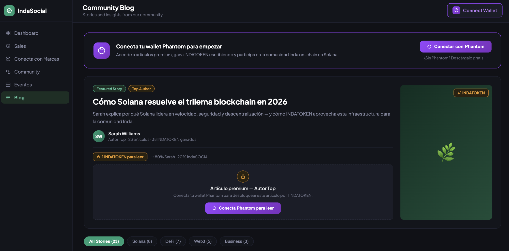
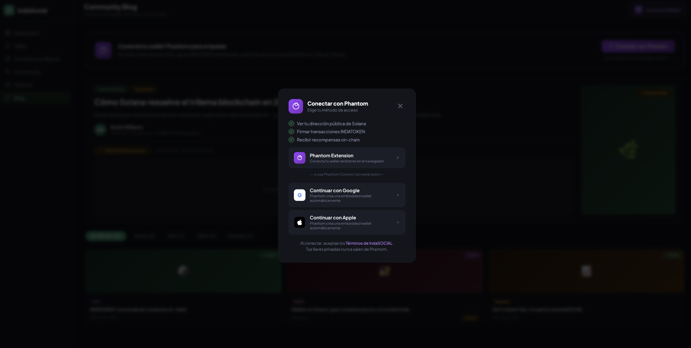
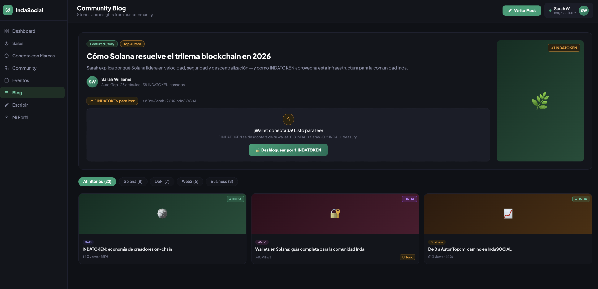

# 🪙 INDATOKEN — Indasocial

> Token SPL nativo de la comunidad Indasocial, construido sobre Solana con Anchor Framework.
> Incentiva la creación de contenido, premia a los mejores autores y habilita pagos dentro de la plataforma.

---

## 🎯 Tokenomics

| Fase | Requisito | Beneficio |
|---|---|---|
| **Fase 1 — Nuevo** | 1–14 artículos | Publica gratis · Sin recompensa |
| **Fase 2 — Establecido** | 15+ artículos | Publica gratis · +1 INDATOKEN por artículo |
| **Fase 3 — Autor Top** | Badge asignado por la plataforma | +5 INDATOKEN bonus · Artículos premium |

**Lectores:** Pagan 1 INDATOKEN para leer artículos de Autores Top → 80% al autor / 20% al treasury.

**Usos del INDATOKEN:** leer artículos premium · pagar eventos · accesos exclusivos · transferencias P2P (Phantom · Solana)

---

## 🏗️ Arquitectura del Programa

```
programs/indatoken/src/
├── lib.rs                    ← Punto de entrada (declare_id! + 6 instrucciones)
├── errors.rs                 ← IndaError (6 tipos de error custom)
├── state/
│   ├── plataforma.rs         ← Struct Plataforma (PDA global)
│   ├── autor.rs              ← Struct AutorCuenta (perfil on-chain)
│   └── articulo.rs           ← Struct Articulo (contenido on-chain)
└── instructions/
    ├── inicializar.rs        ← crear plataforma + mint INDATOKEN
    ├── autor.rs              ← registrar autor + otorgar badge Top
    ├── articulo.rs           ← publicar artículo + recompensas
    ├── leer.rs               ← pago lector (split 80/20)
    └── transferir.rs         ← transferencia libre entre wallets
```

---

## 📡 Instrucciones

| # | Instrucción | Quién la llama |
|---|---|---|
| 1 | `inicializar_plataforma` | Admin IndaSOCIAL (una sola vez) |
| 2 | `registrar_autor` | Cualquier wallet |
| 3 | `publicar_articulo` | El autor registrado |
| 4 | `otorgar_autor_top` | Admin IndaSOCIAL |
| 5 | `leer_articulo_top` | Cualquier lector |
| 6 | `transferir_indatoken` | Cualquier wallet |

---

## 🚀 Deploy en Solana Playground

Ver guía detallada → **[README_DEPLOY.md](./README_DEPLOY.md)**

1. Ir a [beta.solpg.io](https://beta.solpg.io)
2. Crear proyecto Anchor
3. Pegar contenido de `programs/indatoken/src/lib.rs`
4. **Build** 🔨 → **Airdrop** → **Deploy** 🚀

---

## 🖥️ Frontend (maqueta de referencia)

`app/index.html` — Abre directamente en el navegador.

Incluye:
- Blog dark mode con sidebar (fiel al diseño IndaSOCIAL)
- Integración real con **Phantom Connect** (`window.solana`)
- Soporte para Phantom Extension + Google + Apple (Phantom Connect SDK)
- Vista **Write** — editor para publicar artículo on-chain
- Vista **Dashboard** — perfil de Sarah (creadora) con fases, earnings, artículos

---

## 🛠️ Desarrollo local

```bash
yarn install
anchor build
anchor test
```

> Requiere: Rust, Solana CLI 1.18+, Anchor CLI 0.30.1

---

## 💎 Supply INDATOKEN

- **Total:** 1,000,000 INDATOKEN
- **Decimales:** 6
- **Mint authority:** PDA plataforma (programa controla la emisión)
- **Red:** Solana Devnet → Mainnet en producción
- **Wallet:** Phantom

---

## 🏆 Hackathon

Desarrollado para el **Solana LATAM Hackathon | WayLearn**
Presentado en [DoraHacks #1560610](https://dorahacks.io/idea/1560610)

---

*Construido con ❤️ para la comunidad Indasocial — sobre Solana.* 
